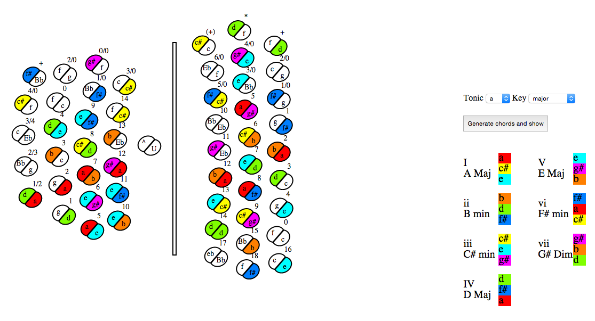

# ChemnitzerConcertina
Helps to learn chemnitzer concertina button layout and chords.

Choose a key and it highlights the buttons on push and pull as well as the basic chords for that key.

Setup:

The directory needs to reside on a webserver running php.
Navigate to the ChemnitzerConcertina folder on the webserver.
Choose a tonic then key and click generate chords and show

Contributing:

Contributions welcome so that this can expand to more keys and 4 and five note chords.  
Also it would be nice to jazz up the ui.